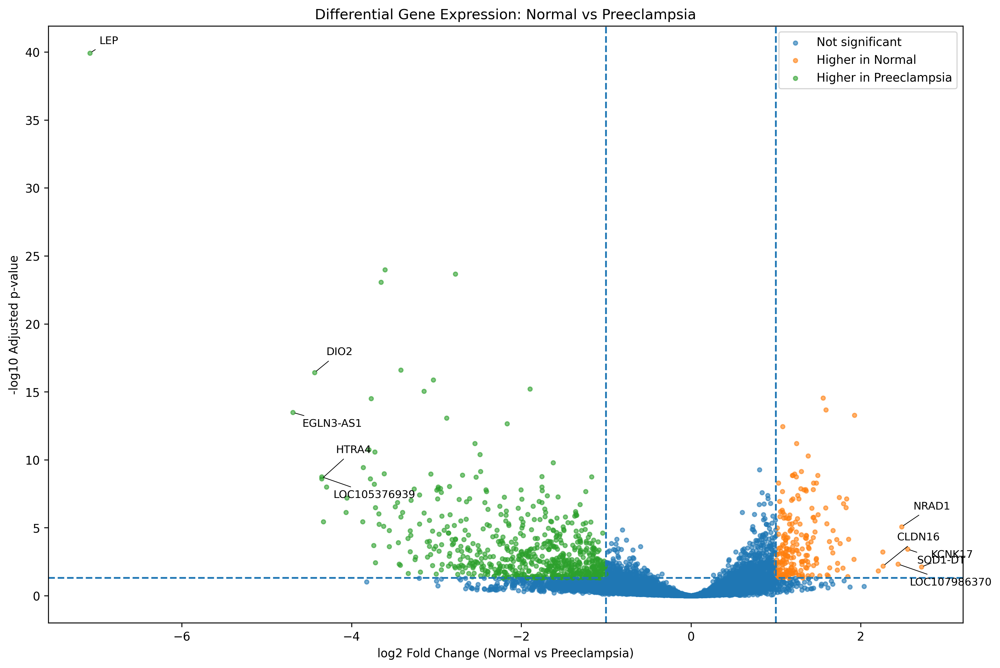

# Preeclampsia Differential Gene Expression Analysis

## Overview

This project investigates differential gene expression between normal and preeclampsia placental samples using publicly available transcriptomic data from the NCBI Gene Expression Omnibus (GEO).

The analysis is based on dataset **GSE190971** and aims to identify genes showing significant expression differences between normal pregnancy and preeclampsia.

## Dataset

- **GEO Accession:** GSE190971
- **Biological Context:** Placental transcriptomics
- **Comparison:** Normal vs Preeclampsia
- **Data Source:** NCBI Gene Expression Omnibus (GEO)
- **Initial Differential Expression Analysis:** GEO2R

## Objectives

The main objectives of this project were to:

- Identify significantly differentially expressed genes (DEGs)
- Filter genes using statistical significance and fold-change thresholds
- Separate genes with higher expression in normal and preeclampsia samples
- Visualize differential gene expression using a volcano plot
- Highlight selected highly significant genes
- Generate reproducible result tables and summary statistics

## Analysis Workflow

1. Obtained differential expression results from GEO2R
2. Imported the results into Python
3. Cleaned and inspected the dataset
4. Applied significance thresholds:
   - Adjusted p-value (padj) < 0.05
   - Absolute log2 fold change ≥ 1
5. Classified significant genes according to expression direction
6. Generated summary statistics
7. Created a labeled volcano plot
8. Exported filtered results as CSV files

## Key Results

- **Total genes analyzed:** 18,765
- **Significant differentially expressed genes:** 854
- **Genes with higher expression in Normal:** 208
- **Genes with higher expression in Preeclampsia:** 646
- **Mean log2 fold change of significant DEGs:** approximately -1.15
- **Median log2 fold change of significant DEGs:** approximately -1.50

These results indicate substantial transcriptomic differences between normal and preeclamptic placental samples.

## Volcano Plot

The volcano plot visualizes the magnitude and statistical significance of differential gene expression.

- Genes with higher expression in Normal are shown separately
- Genes with higher expression in Preeclampsia are shown separately
- Non-significant genes are distinguished from significant DEGs
- Selected highly significant genes are labeled

## Example Genes Highlighted

Selected genes identified among strongly differentially expressed genes include:

- **LEP**
- **DIO2**
- **EGLN3-AS1**
- **HTRA4**
- **EGLN3**

These genes may be relevant for further investigation into placental dysfunction and the molecular mechanisms associated with preeclampsia.

## Repository Contents

- `Preeclampsia_Differential_Gene_Expression_Analysis.ipynb` — Python analysis notebook
- `GSE190971_GEO2R_results.xlsx` — GEO2R differential expression results
- `filtered_DEGs_padj0.05_log2FC1.csv` — Filtered significant DEGs
- `genes_higher_in_normal.csv` — Genes with higher expression in normal samples
- `genes_higher_in_preeclampsia.csv` — Genes with higher expression in preeclampsia samples
- `summary_statistics.csv` — Summary of analysis results
- `volcano_plot_labeled.png` — Labeled volcano plot

## Tools and Technologies

- Python
- Pandas
- NumPy
- Matplotlib
- Google Colab
- GEO2R
- NCBI GEO

## Skills Demonstrated

- Transcriptomic data analysis
- Differential gene expression analysis
- Data cleaning and filtering
- Statistical thresholding
- Biological data interpretation
- Scientific visualization
- Reproducible computational analysis
- GitHub project documentation

## Future Directions

Future work could include:

- Gene Ontology (GO) enrichment analysis
- KEGG pathway enrichment analysis
- Functional interpretation of top candidate genes
- Identification of potential biomarkers
- Comparison with additional preeclampsia transcriptomic datasets

## Author

**Alaina Pervez**

B.Sc. Life Sciences  
University of Delhi

Research interests include bioinformatics, transcriptomics, immunology, reproductive biology, and disease-associated molecular mechanisms.
